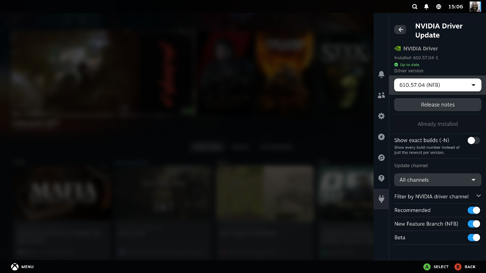
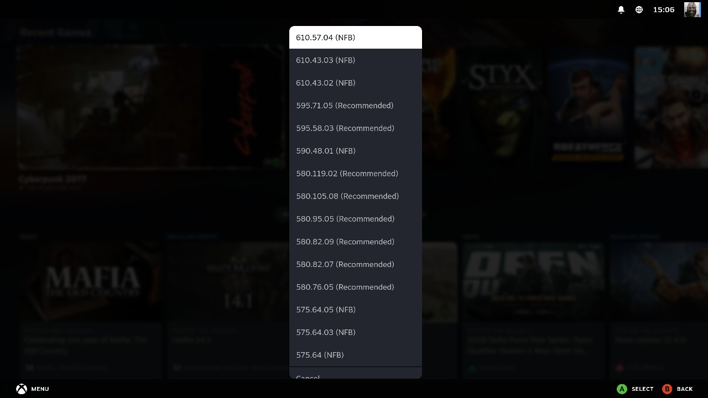
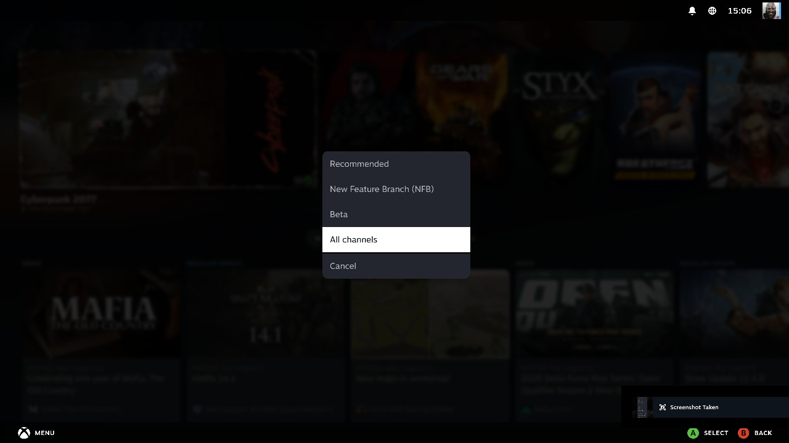
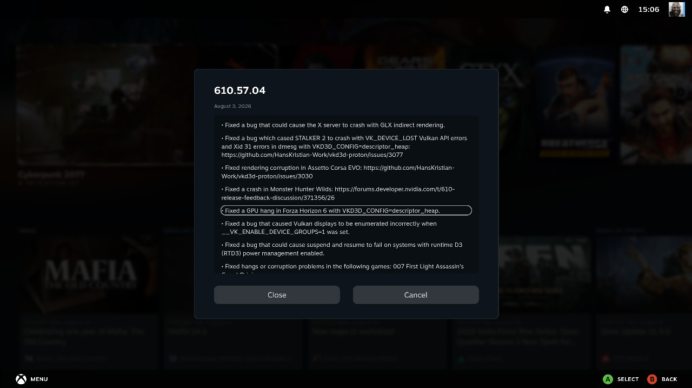

# decky-nvidia-update

A [Decky Loader](https://decky.xyz/) plugin that installs or changes the NVIDIA driver
version directly on a running SteamOS system — no USB stick, no repair image, no OS
reinstall, no reboot until you're actually ready for one.



## Requirements

Needs SteamOS's rootfs-A/B system partitions grown to at least 8GiB — Valve's stock 5GiB
has no headroom left for a driver install (`No space left on device`). Get there with
[steamos-nvidia-installer](https://github.com/moi952/steamos-nvidia-installer) first:

- **Fresh install** — booting its USB installer and choosing "Install SteamOS (NVIDIA) to
  Hard Drive" already sizes rootfs-A/B at 8GiB.
- **Repair an existing install** — booting the same USB and choosing "Upgrade SteamOS
  (NVIDIA) — keeps games & data" prompts a dialog offering to grow rootfs-A/B to 8GiB in
  place (games, saves, and Steam login are untouched).

Once on 8GiB partitions, install this plugin and switch driver versions freely.

## What it does

- Pick any NVIDIA driver version available in the [Arch Linux
  archive](https://archive.archlinux.org/packages/n/nvidia-utils/) and install it in
  place, or just hit the button to grab the latest.
- Every version is tagged with NVIDIA's own official channel — **Recommended**, **New
  Feature Branch (NFB)**, or **Beta** — fetched live from NVIDIA's driver lookup, not
  something Arch's own repos know about on their own.

  

- Filter which channels show up, and choose which one counts as "latest" when you open
  the plugin fresh — Recommended, NFB, Beta, or All channels.

  

- Read the real release notes for any version before installing — fetched live, not
  bundled or guessed.

  

- Live step-by-step progress and a scrollback log while it runs, and a **Reboot now**
  button once it's done.
- Fully localized UI (English, French, Spanish).

## Safety

Games, saves, Steam login, Decky, and every other disk/partition (including a Windows
install if you dual-boot) are never touched:

- The slow/risky part (download, DKMS build, pacman transaction) happens in a throwaway
  overlay stacked on top of the running rootfs — the real system isn't touched until the
  very end.
- The only thing ever written to disk outside that overlay is a single ext4 loopback
  *file* on `/home` used as scratch space during the build — never a raw partition, never
  mounted by device path.
- The real filesystem is unlocked (`steamos-readonly disable`) only for the brief final
  copy, then re-locked immediately, success or failure.
- A reboot is required to actually load a newly installed driver — nothing forces one on
  you.

## Building

```bash
pnpm install
./package.sh
```

`package.sh` builds the frontend and zips a ready-to-install plugin into `packages/`
(auto-incrementing filename, never overwrites a previous build). Install the zip from the
Decky Loader menu (Quick Access → the flask icon → the plus/install button) in Desktop or
Game Mode.

No Docker or Decky CLI needed — the backend is pure standard-library Python (no pip
dependencies to vendor), so a plain `rollup` build of the frontend is enough.

### Faster iteration over SSH (VS Code tasks)

If you're actively developing and want to skip re-zipping/re-installing on every change:

1. Run the **settingscheck** task once — it creates `.vscode/settings.json` from
   `.vscode/defsettings.json`. Edit it with your Deck's IP, SSH user/password/key.
   `.vscode/settings.json` is gitignored — it holds your credentials, never commit it.
2. Run the **builddeploy** task: builds the frontend, rsyncs the plugin folder to
   `~/homebrew/plugins/decky-nvidia-update/` on the Deck, and restarts `plugin_loader`.
3. Enable the plugin from the Decky Loader menu.

## Architecture

- `bin/steamos-nvidia-update.sh` — the actual worker. Runs standalone too (over SSH,
  outside Decky): `sudo ./bin/steamos-nvidia-update.sh --driver 610.57.04 -y`. One
  mechanism, two ways to trigger it.
- `py_modules/nvidia_update/plugin.py` — backend. Runs the script above as a subprocess,
  streams its stdout line-by-line, parses the `[n/8]` step markers, and pushes progress to
  the frontend via `decky.emit` (`nvidia_update_progress` event). Also fetches driver
  version lists (Arch archive) and channel classification (NVIDIA's own driver lookup
  service) for the frontend.
- `src/index.tsx`, `src/VersionDropdown.tsx`, `src/ReleaseNotesModal.tsx` — the UI.

## Credits

This plugin wraps and builds on
[steamos-nvidia-installer](https://github.com/28allday/steamos-nvidia-installer) by
[28allday](https://github.com/28allday) — the underlying driver-install mechanism (overlay,
loopback scratch space, DKMS build) originates there. This project adapts it into a Decky
Loader plugin with a UI.

## License

MIT.
